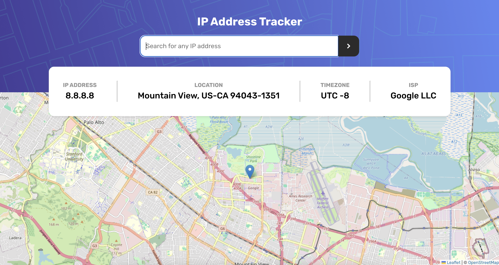

# Frontend Mentor - IP address tracker solution

This is a solution to the [IP address tracker challenge on Frontend Mentor](https://www.frontendmentor.io/challenges/ip-address-tracker-I8-0yYAH0). Frontend Mentor challenges help you improve your coding skills by building realistic projects.

## Table of contents

- [Frontend Mentor - IP address tracker solution](#frontend-mentor---ip-address-tracker-solution)
  - [Table of contents](#table-of-contents)
  - [Overview](#overview)
    - [The challenge](#the-challenge)
    - [Screenshot](#screenshot)
    - [Links](#links)
  - [My process](#my-process)
    - [Built with](#built-with)
    - [What I learned](#what-i-learned)
    - [Continued development](#continued-development)
    - [Useful resources](#useful-resources)
  - [Author](#author)

**Note: Delete this note and update the table of contents based on what sections you keep.**

## Overview

### The challenge

Users should be able to:

- View the optimal layout for each page depending on their device's screen size
- See hover states for all interactive elements on the page
- See their own IP address on the map on the initial page load
- Search for any IP addresses or domains and see the key information and location

### Screenshot



### Links

- Solution URL: [Github](https://github.com/jamesspearsv/ip-tracker)
- Live Site URL: [https://ip-tracker-25k.pages.dev/](https://ip-tracker-25k.pages.dev/)

## My process

### Built with

- Semantic HTML5 markup
- CSS custom properties
- Flexbox
- Mobile-first workflow
- [React](https://reactjs.org/) - JS library
- [TypeScript](https://www.typescriptlang.org/) - Type syntax for JavaScript
- [LeafletJS](https://leafletjs.com/) - Open source JS library for interactive maps
- [Vite](https://vite.dev/) - Front end build tool

### What I learned

This project required the use of LeafletJS to render and display an interactive map given a set of coordinates. I ran into some challenges using the library with React. In the process of completing this challenge I learned how to better use the `useRef` hook from React. Below is my approach to integrating LeafletJS with React using `useRef`

```typescript
// Snippet from Map.tsx

export default function Map({ lat, long }: MapProps) {
  // define refs to div#map and leaflet Map class
  const mapRef = useRef<HTMLDivElement>(null);
  const leafletMap = useRef<L.Map | null>(null);

  useEffect(() => {
    // if map has not been initiated yet
    if (mapRef.current && !leafletMap.current) {
      const map = L.map(mapRef.current, { zoomControl: false }).setView(
        [lat, long],
        13
      );

      L.tileLayer('https://tile.openstreetmap.org/{z}/{x}/{y}.png', {
        maxZoom: 19,
        attribution:
          '&copy; <a href="http://www.openstreetmap.org/copyright">OpenStreetMap</a>',
      }).addTo(map);

      L.marker([lat, long]).addTo(map);

      leafletMap.current = map;
    } else if (leafletMap.current) {
      leafletMap.current.setView([lat, long], 13);
    }

    // Cleanup when component unmounts
    return () => {
      if (leafletMap.current) {
        leafletMap.current.remove();
        leafletMap.current = null;
      }
    };
  }, [lat, long]);

  return <div ref={mapRef} className={styles.map}></div>;
}
```

### Continued development

I used [IP GeoLocation API](https://ipgeolocation.io/) which provides a free tier that provides basic IP geolocation. The free tier does not include IP geolocation for domains. Future development of this project could make use a more featured free API to add this a domain look up feature.

### Useful resources

Helpful articles and guides on `useRef`

- [useRef - React Docs](https://react.dev/reference/react/useRef)
- [React useRef Hooks](https://www.w3schools.com/react/react_useref.asp)

## Author

- Website - [James Spears](https://jspears.me)
- Frontend Mentor - [@yourusername](https://www.frontendmentor.io/profile/yourusername)
